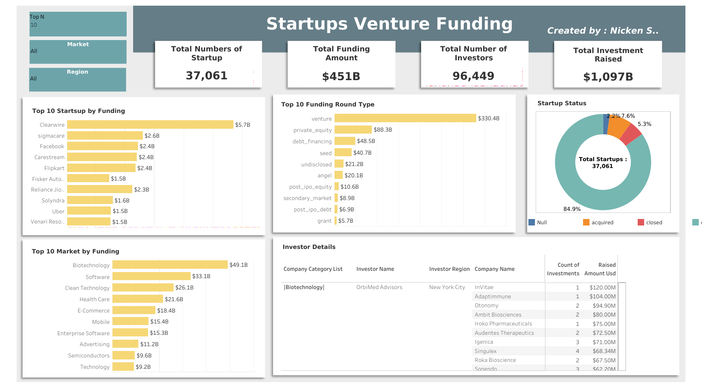

# Startup Venture Funding Dashboard Data Analysis

## Project Description

**Overview :**

The Startup Venture Funding Dashboard is a comprehensive visual representation of the dynamic landscape of startup funding, providing valuable insights into the top startups, funding round types, markets, startup statuses, and investor details. The dashboard utilizes five key sheets to present a holistic view of the startup ecosystem.

## Project Goal

The project aims to provide a centralized and visually intuitive platform that encapsulates key metrics and insights regarding startup funding.

## Tools & Library Used

 &nbsp;

## Project Result

[Click here to get dashboard link](https://public.tableau.com/shared/XTNZYMB7N?:display_count=n&:origin=viz_share_link)

### Dashboard Insight:

1. Total Number of Startups: 37,061
2. Total Funding Amount: $451 billion
3. Total Number of Investors: 96,449
4. Total Investment Raised: $1,097 billion
5. Top 10 Startups by Funding:

   - Bar chart displaying the funding amounts of the top 10 startups.
   - Key Insight: Clearwire leads with $5.7 billion in funding.

6. Top 10 Funding Round Types:

   - Bar chart illustrating the distribution of funding across different round types.
   - Key Insight: Venture rounds dominate with a total funding of $330.4 billion.

7. Top 10 Markets by Funding:

   - Bar chart showcasing funding amounts in various markets.
   - Key Insight: Biotechnology emerges as the leading market with $49.1 billion in funding.

8. Startup Status:

   - Donut pie chart representing the distribution of startups based on their status.
   - Key Insight: 84.9% of startups are currently operating.

9. Investor Details:
   - Sheet providing detailed information on investors participating in startup funding.

### Recommendation

- Given that venture rounds dominate with $330.4 billion, investors may consider maintaining a focus on venture funding as it represents a significant portion of the overall funding landscape.
- Biotechnology emerges as the leading market with $49.1 billion in funding. Entrepreneurs and investors may explore opportunities within the biotechnology sector, considering the demonstrated investor interest and potential for growth.
- As 84.9% of startups are currently operating, there is a strong emphasis on sustaining and growing existing ventures. Investors may focus on startups with a proven track record of operation for potential long-term returns.
- Startups with high funding amounts, such as Clearwire with $5.7 billion, may be attractive for potential strategic partnerships. Investors and corporations could explore collaboration opportunities with these high-performing startups.
